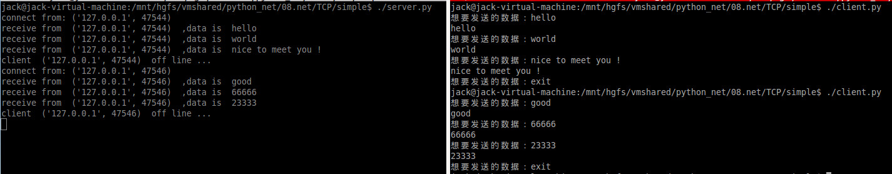
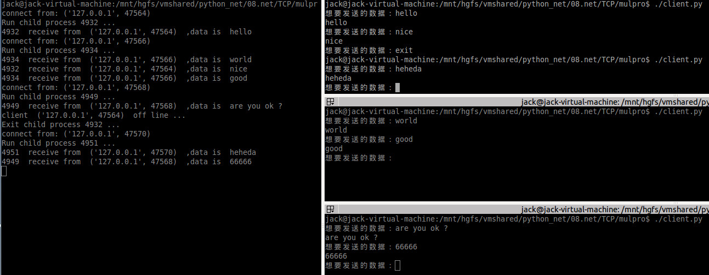
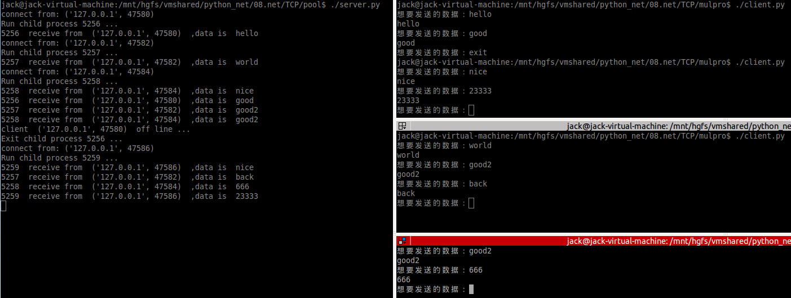
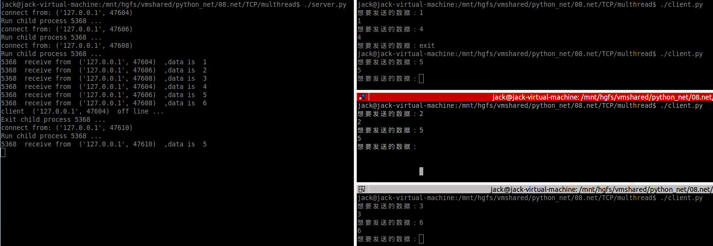
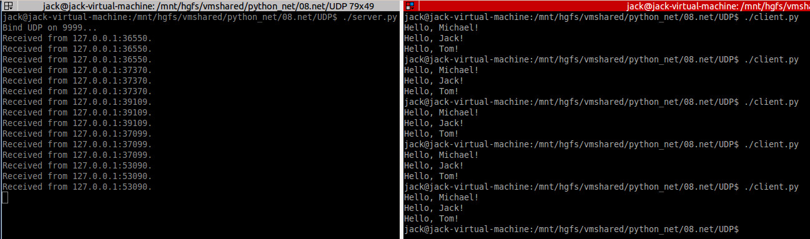

<!-- START doctoc generated TOC please keep comment here to allow auto update -->
<!-- DON'T EDIT THIS SECTION, INSTEAD RE-RUN doctoc TO UPDATE -->


- [网络编程](#%E7%BD%91%E7%BB%9C%E7%BC%96%E7%A8%8B)
    - [一、TCP 编程](#%E4%B8%80tcp-%E7%BC%96%E7%A8%8B)
      - [1、简单回射服务器](#1%E7%AE%80%E5%8D%95%E5%9B%9E%E5%B0%84%E6%9C%8D%E5%8A%A1%E5%99%A8)
      - [2、多进程回射服务器](#2%E5%A4%9A%E8%BF%9B%E7%A8%8B%E5%9B%9E%E5%B0%84%E6%9C%8D%E5%8A%A1%E5%99%A8)
      - [3、进程池回射服务器](#3%E8%BF%9B%E7%A8%8B%E6%B1%A0%E5%9B%9E%E5%B0%84%E6%9C%8D%E5%8A%A1%E5%99%A8)
      - [4、多线程回射服务器](#4%E5%A4%9A%E7%BA%BF%E7%A8%8B%E5%9B%9E%E5%B0%84%E6%9C%8D%E5%8A%A1%E5%99%A8)
    - [二、UDP编程](#%E4%BA%8Cudp%E7%BC%96%E7%A8%8B)

<!-- END doctoc generated TOC please keep comment here to allow auto update -->

# 网络编程

### 一、TCP 编程

参考 [Python3 网络编程](https://www.runoob.com/python3/python3-socket.html)

#### 1、简单回射服务器

一个简单的只对一个客户端服务的回射服务器案例，服务端收到什么信息就返回什么信息，代码可见 src/TCP/simple/server.py：

```python
#!/usr/bin/python3

# 导入 socket、sys 模块
import socket
import sys

# 端口
port = 9999
# 缓冲区大小
BUFSIZ = 1024
# 本机地址
host = '127.0.0.1'

def main():
	# 创建 socket 对象
	serversocket = socket.socket(socket.AF_INET, socket.SOCK_STREAM) 

	# 设置地址复用
	serversocket.setsockopt(socket.SOL_SOCKET, socket.SO_REUSEADDR, 1)
	# 设置保活时间
	serversocket.setsockopt(socket.SOL_SOCKET, socket.SO_KEEPALIVE, 1)
	serversocket.setsockopt(socket.SOL_TCP, socket.TCP_KEEPIDLE, 2)
	serversocket.setsockopt(socket.SOL_TCP, socket.TCP_KEEPINTVL, 1)
	serversocket.setsockopt(socket.SOL_TCP, socket.TCP_KEEPCNT, 3)
		
	# 绑定端口号
	serversocket.bind((host, port))
	# 设置最大连接数，超过后排队
	serversocket.listen(5)

	while True:
		# 建立客户端连接
		conn, addr = serversocket.accept()  
		print('connect from:', addr)
		while True: 
			try:
				recvdata = conn.recv(BUFSIZ).decode('utf-8')
			except Exception:
				print('Time out ...')
			# read返回0，说明对方已经关闭连接，服务端处于CLOSE_WAIT状态
			if not recvdata:
				print('client ', addr, ' off line ...')
				break
			else:
				print('receive from ', addr, ' ,data is ', recvdata)
				# 回射回去
				conn.send(recvdata.encode('utf-8'))
		conn.close()		
	serversocket.close()
	
if __name__ == "__main__":
    main()
```

客户端代码可见src/TCP/simple/client.py：

```python
#!/usr/bin/python3

from socket import *

# 服务器的ip地址
address='127.0.0.1'   
# 服务器的端口号
port=9999           
# 接收数据的缓存大小
buffsize=1024   

def main():     
	s = socket(AF_INET, SOCK_STREAM)
	s.connect((address,port))
	while True:
		senddata = input('想要发送的数据：')
		if senddata == 'exit':
			break
		else:
			s.send(senddata.encode())
			recvdata=s.recv(buffsize).decode('utf-8')
			print(recvdata)
		
	s.close()

if __name__ == "__main__":
    main()
```

效果如下：



#### 2、多进程回射服务器

客户端代码不变，服务端代码可见 src/TCP/mulpro/server.py：

```python
#!/usr/bin/python3

# 导入 socket、sys 模块
import socket
import sys
from multiprocessing import Process
import os

# 端口
port = 9999
# 缓冲区大小
BUFSIZ = 1024
# 本机地址
host = '127.0.0.1'

# 子进程要执行的代码
def service(conn, addr):
	print('Run child process %s ...' % (os.getpid()))
	while True: 
		try:
			recvdata = conn.recv(BUFSIZ).decode('utf-8')
		except Exception:
			print('Time out ...')
		# read返回0，说明对方已经关闭连接，服务端处于CLOSE_WAIT状态
		if not recvdata:
			print('client ', addr, ' off line ...')
			break
		else:
			print(os.getpid(), ' receive from ', addr, ' ,data is ', recvdata)
			# 回射回去
			conn.send(recvdata.encode('utf-8'))		
	conn.close()
	print('Exit child process %s ...' % (os.getpid()))
	
def main():
	# 创建 socket 对象
	serversocket = socket.socket(socket.AF_INET, socket.SOCK_STREAM) 

	# 设置地址复用
	serversocket.setsockopt(socket.SOL_SOCKET, socket.SO_REUSEADDR, 1)
	# 设置保活时间
	serversocket.setsockopt(socket.SOL_SOCKET, socket.SO_KEEPALIVE, 1)
	serversocket.setsockopt(socket.SOL_TCP, socket.TCP_KEEPIDLE, 2)
	serversocket.setsockopt(socket.SOL_TCP, socket.TCP_KEEPINTVL, 1)
	serversocket.setsockopt(socket.SOL_TCP, socket.TCP_KEEPCNT, 3)
		
	# 绑定端口号
	serversocket.bind((host, port))
	# 设置最大连接数，超过后排队
	serversocket.listen(5)

	while True:
		# 建立客户端连接
		conn, addr = serversocket.accept()  
		print('connect from:', addr)
		p = Process(target=service, args=(conn, addr,))
		p.start()
		conn.close()

					
	serversocket.close()
	
if __name__ == "__main__":
    main()
```

效果如下：



#### 3、进程池回射服务器

客户端代码不变，服务端代码可见src/TCP/pool/server.py：

```python
#!/usr/bin/python3

# 导入 socket、sys 模块
import socket
import sys
from multiprocessing import Pool
import os

# 端口
port = 9999
# 缓冲区大小
BUFSIZ = 1024
# 本机地址
host = '127.0.0.1'
# 进程池大小
POOLSIZE = 4
# 子进程要执行的代码
def service(conn, addr):
	print('Run child process %s ...' % (os.getpid()))
	while True: 
		try:
			recvdata = conn.recv(BUFSIZ).decode('utf-8')
		except Exception:
			print('Time out ...')
		# read返回0，说明对方已经关闭连接，服务端处于CLOSE_WAIT状态
		if not recvdata:
			print('client ', addr, ' off line ...')
			break
		else:
			print(os.getpid(), ' receive from ', addr, ' ,data is ', recvdata)
			# 回射回去
			conn.send(recvdata.encode('utf-8'))		
	conn.close()
	print('Exit child process %s ...' % (os.getpid()))
	
def main():
	# 创建 socket 对象
	serversocket = socket.socket(socket.AF_INET, socket.SOCK_STREAM) 

	# 设置地址复用
	serversocket.setsockopt(socket.SOL_SOCKET, socket.SO_REUSEADDR, 1)
	# 设置保活时间
	serversocket.setsockopt(socket.SOL_SOCKET, socket.SO_KEEPALIVE, 1)
	serversocket.setsockopt(socket.SOL_TCP, socket.TCP_KEEPIDLE, 2)
	serversocket.setsockopt(socket.SOL_TCP, socket.TCP_KEEPINTVL, 1)
	serversocket.setsockopt(socket.SOL_TCP, socket.TCP_KEEPCNT, 3)
		
	# 绑定端口号
	serversocket.bind((host, port))
	# 设置最大连接数，超过后排队
	serversocket.listen(5)

	p = Pool(POOLSIZE)
	while True:
		# 建立客户端连接
		conn, addr = serversocket.accept()  
		print('connect from:', addr)
		p.apply_async(service, args=(conn, addr,))
		#conn.close() #千万不可调用此句，否则会关闭进程中的连接
					
	serversocket.close()
	p.join()
	p.close()
	
if __name__ == "__main__":
    main()
```

效果如下：



#### 4、多线程回射服务器

代码可见src/TCP/multhread.py：

```python
#!/usr/bin/python3

# 导入 socket、sys 模块
import socket
import sys
import threading
import os

# 端口
port = 9999
# 缓冲区大小
BUFSIZ = 1024
# 本机地址
host = '127.0.0.1'

# 子进程要执行的代码
def service(conn, addr):
	print('Run child process %s ...' % (os.getpid()))
	recvdata = ''
	while True: 
		try:
			recvdata = conn.recv(BUFSIZ).decode('utf-8')
		except Exception:
			print('Time out ...')
		# read返回0，说明对方已经关闭连接，服务端处于CLOSE_WAIT状态
		if not recvdata:
			print('client ', addr, ' off line ...')
			break
		else:
			print(os.getpid(), ' receive from ', addr, ' ,data is ', recvdata)
			# 回射回去
			conn.send(recvdata.encode('utf-8'))		
	conn.close()
	print('Exit child process %s ...' % (os.getpid()))
	
def main():
	# 创建 socket 对象
	serversocket = socket.socket(socket.AF_INET, socket.SOCK_STREAM) 

	# 设置地址复用
	serversocket.setsockopt(socket.SOL_SOCKET, socket.SO_REUSEADDR, 1)
	# 设置保活时间
	serversocket.setsockopt(socket.SOL_SOCKET, socket.SO_KEEPALIVE, 1)
	serversocket.setsockopt(socket.SOL_TCP, socket.TCP_KEEPIDLE, 2)
	serversocket.setsockopt(socket.SOL_TCP, socket.TCP_KEEPINTVL, 1)
	serversocket.setsockopt(socket.SOL_TCP, socket.TCP_KEEPCNT, 3)
		
	# 绑定端口号
	serversocket.bind((host, port))
	# 设置最大连接数，超过后排队
	serversocket.listen(5)

	while True:
		# 建立客户端连接
		conn, addr = serversocket.accept()
		print('connect from:', addr)
		t = threading.Thread(target=service, args=(conn, addr,))
		t.start()
		# conn.close() # 千万不可调用此句，线程与主进程共享该描述符，这里关闭了就意味着连接关闭了

	serversocket.close()
	
if __name__ == "__main__":
    main()
```

测试结果如下：



### 二、UDP编程

这块就简单介绍下，代码在src/UDP下。

服务端：

```python
#!/usr/bin/env python3

import socket

s = socket.socket(socket.AF_INET, socket.SOCK_DGRAM)

# 绑定端口:
s.bind(('127.0.0.1', 9999))

print('Bind UDP on 9999...')

while True:
    # 接收数据:
    data, addr = s.recvfrom(1024)
    print('Received from %s:%s.' % addr)
    reply = 'Hello, %s!' % data.decode('utf-8')
    s.sendto(reply.encode('utf-8'), addr)
```

客户端：

```python
#!/usr/bin/env python3

import socket

s = socket.socket(socket.AF_INET, socket.SOCK_DGRAM)

for data in [b'Michael', b'Jack', b'Tom']:
    # 发送数据:
    s.sendto(data, ('127.0.0.1', 9999))
    # 接收数据:
    print(s.recv(1024).decode('utf-8'))

s.close()
```

效果如下：

