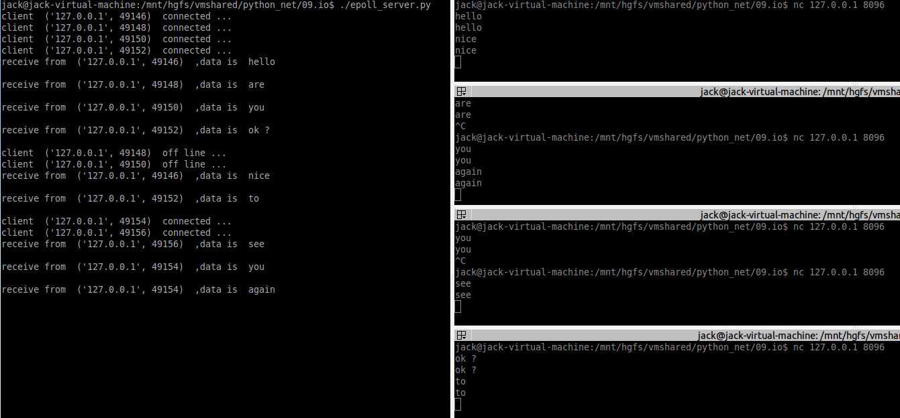

<!-- START doctoc generated TOC please keep comment here to allow auto update -->
<!-- DON'T EDIT THIS SECTION, INSTEAD RE-RUN doctoc TO UPDATE -->

- [IO 复用](#io-%E5%A4%8D%E7%94%A8)
    - [1、select](#1select)
    - [2、epoll](#2epoll)

<!-- END doctoc generated TOC please keep comment here to allow auto update -->

# IO 复用

参考 [python之IO多路复用](https://www.cnblogs.com/clschao/articles/9713797.html) [python--selectors模块](https://www.cnblogs.com/clschao/articles/9718463.html)

### 1、select

python中也提供了select接口，直接上代码src/select_server.py：

```python
#!/usr/bin/env python3

from socket import *
import select

ADDR = '127.0.0.1'
PORT = 8096

def main():
	# 创建监听套接字
	server = socket(AF_INET, SOCK_STREAM)
	# 设置监听套接字为非阻塞
	server.setblocking(False)
	# 设置地址复用
	server.setsockopt(SOL_SOCKET, SO_REUSEADDR, 1)
	# 绑定地址和端口
	server.bind((ADDR, PORT))
	# 监听
	server.listen(5)

	# read_fds 存放所有read事件发生的文件描述符，初始化将服务端socket对象加入监听列表
	read_fds=[server,]

	print('启动服务...')

	while True:
		# 启用select，如果监听套接字集合中有事件发生则返回，超时时间为1s，返回发生读、写和错误的文件描述符集合
		rfds, wfds, efds = select.select(read_fds, [], [], 1)
		# 遍历rfds，处理集合中套接字的“读事件”
		for sock in rfds:
			# socket 监听套接字上发生了读事件, 说明有客户端连接
			if sock == server:
				# accept 客户端的连接, 获取客户端套接字和地址
				conn, addr = sock.accept()
				print('client ', addr, ' connected ...')
				# 把新的客户端连接加入到“读事件”监听列表中，监听该客户端套接字上的“读事件”
				read_fds.append(conn)
			else:
				# 客户端套接字上有“读事件”发生，处理该客户端事件
				try:
					data = sock.recv(1024).decode('utf-8') # 读取客户端发来的数据
					peer = sock.getpeername()
					# read返回0，说明客户端关闭连接，将该客户端从监听列表中移除
					if not data:
						print('client ', peer, ' off line ...')
						sock.close()  # 关闭该套接字，释放资源
						read_fds.remove(sock)
						continue # 继续处理下一个套接字事件
					print('receive from ', peer, ' ,data is ', data)
					# 将消息回射给客户端
					sock.send(data.encode('utf-8'))
				#如果这个连接出错了，客户端暴力断开了（注意，我还没有接收他的消息，或者接收他的消息的过程中出错了）
				except Exception:
					print('Exception.......')
					# 关闭该连接
					sock.close()
					# 直接移除
					read_fds.remove(sock)
					
if __name__ == "__main__":
    main()
```

为了方便，这里的客户端使用了nc工具，测试结果如下：


### 2、epoll

同样地，直接上代码src/epoll_server.py：

```python
#!/usr/bin/env python3

import select  
import socket    

ADDR = '127.0.0.1'
PORT = 8096

def main():
	serversocket = socket.socket(socket.AF_INET, socket.SOCK_STREAM)  
	# socket默认是阻塞的，需要开启非阻塞模式。  
	serversocket.setblocking(False)
	serversocket.setsockopt(socket.SOL_SOCKET, socket.SO_REUSEADDR, 1)
	serversocket.bind((ADDR, PORT))  
	serversocket.listen(5)

	# 创建一个epoll对象  
	epoll = select.epoll()  
	# 在监听套接字上面注册对“读事件”的关注，监听套接字发生读事件说明有客户端连接到来 
	epoll.register(serversocket.fileno(), select.EPOLLIN)  

	try:  
		# 字典conns映射文件描述符（整数）到其相应的网络连接对象  
		conns = {}  
		while True:  
			# 调用poll，超时时间为1s  
			events = epoll.poll(1)  
			# event作为一个序列（fileno，event）的元组返回  
			for fileno, event in events:  
				# 监听套接字上有连接到来 
				if fileno == serversocket.fileno():  
					conn, addr = serversocket.accept()  
					print('client ', addr, ' connected ...')
					# 设置新的socket为非阻塞模式  
					conn.setblocking(False)  
					# 为新的socket注册对读（EPOLLIN）event的关注  
					epoll.register(conn.fileno(), select.EPOLLIN)  
					conns[conn.fileno()] = conn  
				# 如果客户端连接套接字发生一个读event，直接读取数据并回射回去 
				elif event & select.EPOLLIN:  
					# 接收客户端发送过来的数据  
					data = conns[fileno].recv(1024).decode('utf-8') 
					peer = conns[fileno].getpeername()
					# 如果客户端退出,关闭客户端连接，取消所有的读和写监听  
					if not data:  
						print('client ', peer, ' off line ...')
						conns[fileno].close()  
						# 删除conns字典中的监听对象  
						del conns[fileno]  
						epoll.unregister(fileno)  
					else:  
						print('receive from ', peer, ' ,data is ', data)
				# HUP（挂起）event表明客户端socket已经断开（即关闭），所以服务端也需要关闭。  
				# 没有必要注册对HUP event的关注。在socket上面，它们总是会被epoll对象注册  
				elif event & select.EPOLLHUP:  
					# 注销对此socket连接的关注  
					epoll.unregister(fileno)  
					# 关闭socket连接  
					conns[fileno].close()  
					del conns[fileno]  
					peer = conns[fileno].getpeername()
					print('client ', peer, ' off line ...')
	finally:  
		# 打开的socket连接不需要关闭，因为Python会在程序结束的时候关闭。
		epoll.unregister(serversocket.fileno())  
		epoll.close()  
		serversocket.close()  
		
if __name__ == "__main__":
    main()
```

测试结果如下：



